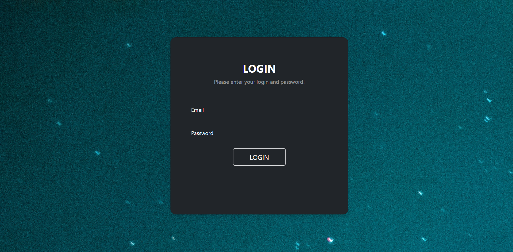

# LRCP
## _Leave Request and Complaint Portal_

## Introduction:
- LRCP is a fully responsive web app to automate the complaining process and to make leave request process easier and faster.

- It has two panels- Admin Panel and User Panel. 

  
- From Admin panel, admin can reject or approve the leave requests as per the reason provided by user.

- From user panel, user can send their complaints through complaint portal and can send their leave requests through leave request portal and also check the current status in realtime.

## Technology Stack:
  1) HTML
  2) CSS
  3) BootStrap
  4) Javascript
  5) JQuery
  3) Firebase Database
  
## Screenshots

 

